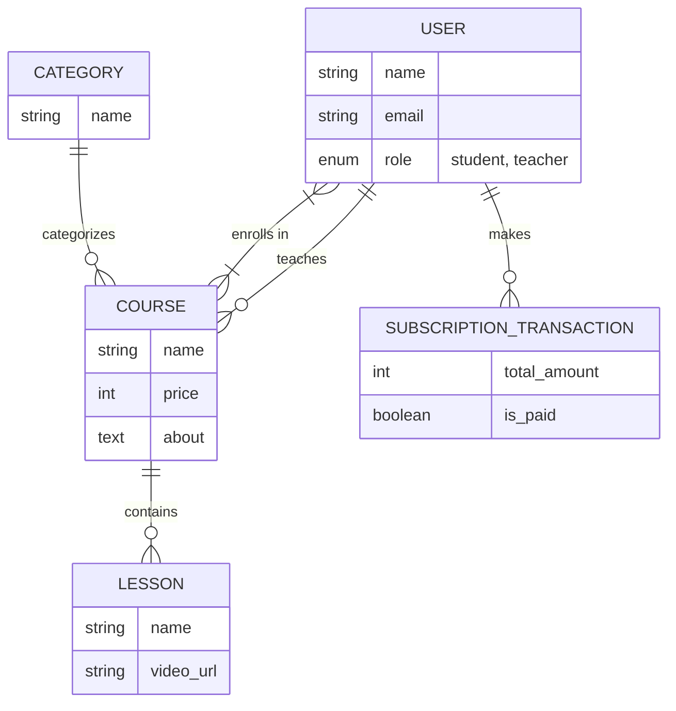
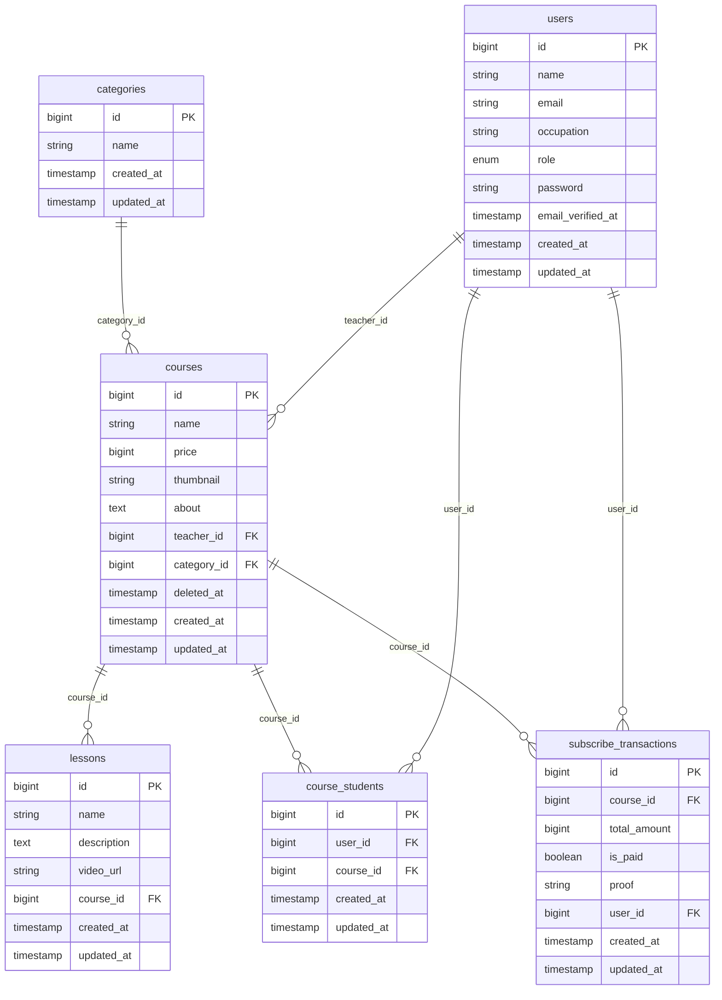
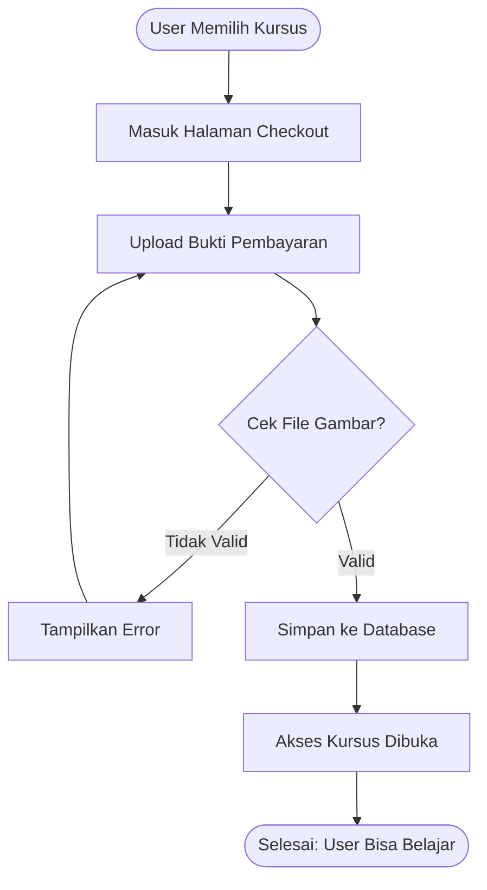

# System Design Diagrams

## 1. Conceptual Data Model (CDM)
The CDM represents the high-level entities and their relationships.

## 2. Physical Data Model (PDM)
The PDM shows the specific database tables, columns, data types, and foreign keys.

## 3. Transaction Flow (Sequence Diagram)
This diagram illustrates the process of a student purchasing a course.

